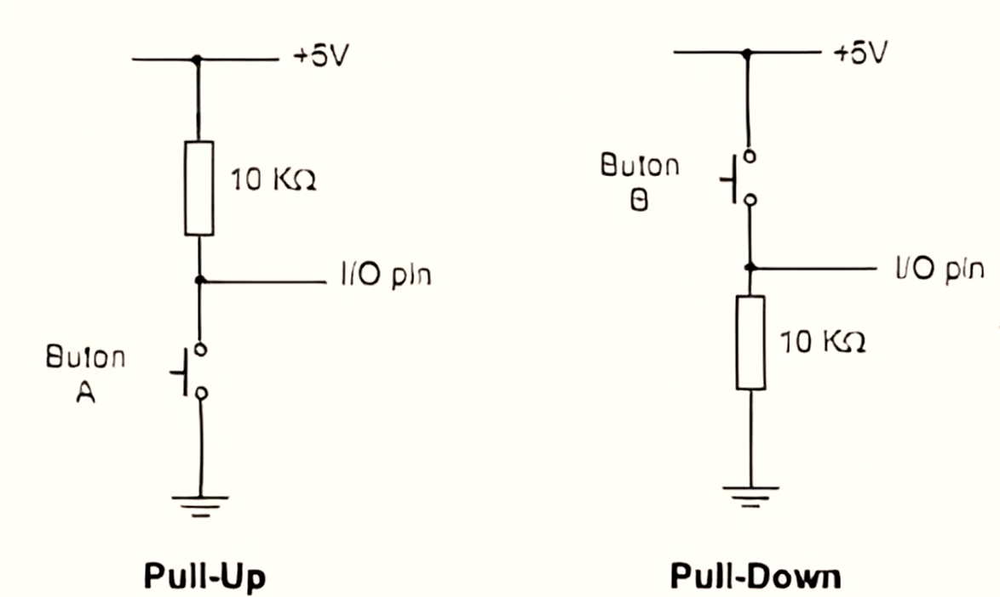

# 📘 Aula – Resistores Pull-Up e Pull-Down  

## 🔹 Introdução  
Resistores de **Pull-Up** e **Pull-Down** servem para **garantir um estado lógico definido** (0 ou 1) em pinos de entrada digital.  
Sem eles, o pino pode ficar em estado **flutuante**, captando ruídos e mudando de valor sozinho.  

---

## 🔹 Pull-Up  

- **Conexão:** resistor entre o pino de entrada e o **Vcc (+5V)**.  
- **Comportamento:**  
  - Entrada fica em **nível lógico ALTO (1)** quando o botão está aberto.  
  - Ao pressionar o botão, a entrada é conectada ao **GND**, ficando em **BAIXO (0)**.  

### 💭 Dúvidas Frequentes (FAQ)  
❓ Por que não ligar direto no Vcc?  
→ Porque sem o resistor, ao pressionar o botão, haveria **curto-circuito** entre Vcc e GND.  

❓ Preciso sempre de resistor externo?  
→ Não. Muitos microcontroladores (PIC, AVR, ESP32, etc.) já possuem **pull-up interno** ativado por software.  

### 📌 Exemplo prático  
Um botão de **reset** em microcontrolador:  
- Sem pull-up → o pino reset ficaria flutuando, causando reinícios aleatórios.  
- Com pull-up → fica em nível alto até o botão ser pressionado (forçando 0).  

---

## 🔹 Pull-Down  

- **Conexão:** resistor entre o pino de entrada e o **GND (0V)**.  
- **Comportamento:**  
  - Entrada fica em **nível lógico BAIXO (0)** quando o botão está aberto.  
  - Ao pressionar o botão, a entrada é conectada ao **Vcc**, ficando em **ALTO (1)**.  

### 💭 Dúvidas Frequentes (FAQ)  
❓ Por que usar pull-down se posso inverter a lógica?  
→ Depende do circuito. Alguns periféricos esperam que o sinal padrão seja **0** e só vá a 1 quando acionado.  

❓ Posso misturar pull-up e pull-down no mesmo projeto?  
→ Sim, depende da lógica que você deseja.  

### 📌 Exemplo prático  
Um **sistema de seleção de modo** (ex.: Modo Normal = 0, Modo Teste = 1).  
- Sem pull-down → o pino poderia oscilar sem motivo.  
- Com pull-down → sempre será 0 até que o botão seja apertado para 1.  

---

## 🔹 Comparação  

| Tipo       | Resistor ligado a | Estado quando aberto | Estado quando fechado |
|------------|-------------------|-----------------------|------------------------|
| **Pull-Up**   | +Vcc             | 1 (ALTO)              | 0 (BAIXO, GND)         |
| **Pull-Down** | GND              | 0 (BAIXO)             | 1 (ALTO, Vcc)          |

---

## 🔹 Valores típicos  
- **1 kΩ a 100 kΩ**  
- Mais usado: **10 kΩ**  
- Muito baixo → desperdiça corrente.  
- Muito alto → não garante polarização (ruído entra).  

---

## 🔹 Analogias  
- **Pull-Up:** 🎈 balão preso no teto → sempre em cima até alguém puxar para baixo.  
- **Pull-Down:** ⚽ bola no chão → sempre embaixo até alguém levantar.  
