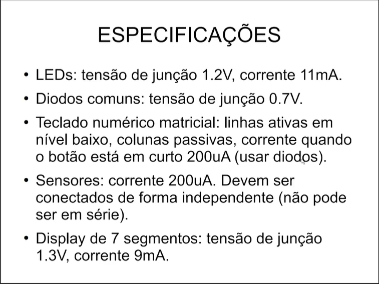

# 📘 Central de Alarme – Introdução

## 🎯 Objetivo do Projeto
Este projeto tem como objetivo desenvolver uma **Central de Alarme** baseada no microcontrolador **PIC18F4550**, utilizando o software **EasyEDA Free** para esquemáticos/PCB e documentando todo o processo neste repositório GitHub.

A Central de Alarme será composta por:
- Teclado matricial 4x3
- LEDs de indicação
- Display de 7 segmentos
- Display LCD1602
- Sensores independentes
- Circuitos básicos de alimentação, clock e reset

---

## 🛠️ Ferramentas Utilizadas
- **EasyEDA (Free)** – desenho de esquemáticos e layout PCB  
- **GitHub** – documentação do projeto em Markdown  
- **PIC18F4550** – microcontrolador principal  
- **Datasheets** dos componentes (LED, diodo, display, teclado)  

---

## 📐 Especificações Técnicas (resumo)
Conforme referência do professor e cálculos iniciais:

# 📐 Cálculos de Componentes – Central de Alarme

## LEDs
- **Dados típicos**:  
  - Tensão direta (Vf) ≈ 1.2 V  
  - Corrente desejada (If) ≈ 11 mA  

- **Cálculo do resistor**:  
  \[
  R = \frac{V_{fonte} - V_f}{I_f}
  \]  
  Supondo fonte de 5 V:  
  \[
  R = \frac{5 - 1.2}{0.011} \approx 345 \, \Omega
  \]  
- **Valor escolhido**: **330 Ω** (valor comercial próximo).

---

## Display de 7 Segmentos
- **Dados típicos (catodo comum)**:  
  - Tensão por segmento (Vf) ≈ 1.3 V  
  - Corrente desejada (If) ≈ 9 mA  

- **Cálculo do resistor**:  
  \[
  R = \frac{5 - 1.3}{0.009} \approx 411 \, \Omega
  \]  
- **Valor escolhido**: **430 Ω** (mais próximo da série E12, protege o PIC).

---

## Teclado Matricial
- **Objetivo**: limitar corrente de varredura.  
- Corrente alvo: ≈ 200 µA  
- Diodo 1N4148: queda ≈ 0.7 V  
- Resistores:  
  \[
  R = \frac{5 - 0.7}{200 \times 10^{-6}} \approx 21.5 \, k\Omega
  \]  
- **Valor escolhido**: **22 kΩ**.

---

## Sensores (Entradas Digitais)
- **Objetivo**: correntes de pull ≈ 200 µA  
- Cálculo:  
  \[
  R = \frac{5}{200 \times 10^{-6}} \approx 25 \, k\Omega
  \]  
- **Valor escolhido**: **24 kΩ** (independentes, **não em série**).

---

## LCD 1602
- **Contraste**:  
  - Ajustado com trimpot de **4.7 kΩ** ligado ao pino V0.  
  - Permite regulagem do brilho do fundo dos caracteres.

---

## Oscilador
- **Clock principal**: cristal de **8 MHz**  
- Capacitores de carga: **27 pF** (um em cada terminal para GND).

---

## Reset
- **Power-on Reset (MCLR)**:  
  - Resistor pull-up: **10 kΩ**  
  - Capacitor para terra: **1 µF**  
  - Forma um atraso RC para garantir reset na energização.

---

---

## 📂 Organização da Documentação
O projeto será dividido em partes, cada uma em seu próprio arquivo `.md` dentro da pasta `Projetos/1.Central _de_Alarme/`:

1. **Introdução** (este arquivo)  
2. **Parte 01 – Base do Projeto** (alimentação, reset, clock, pinagem inicial)  
3. **Parte 02 – LEDs e Display de 7 segmentos**  
4. **Parte 03 – Teclado Matricial**  
5. **Parte 04 – Sensores**  
6. **Parte 05 – LCD1602**  
7. **Parte 06 – Firmware**  
8. **Parte 07 – Checklist Final**  

---

## ✅ Próximos Passos
- Criar **Parte 01** documentando alimentação, reset, clock e mapa de pinos.  
- Configurar o ambiente no EasyEDA e salvar os primeiros esquemáticos.  
