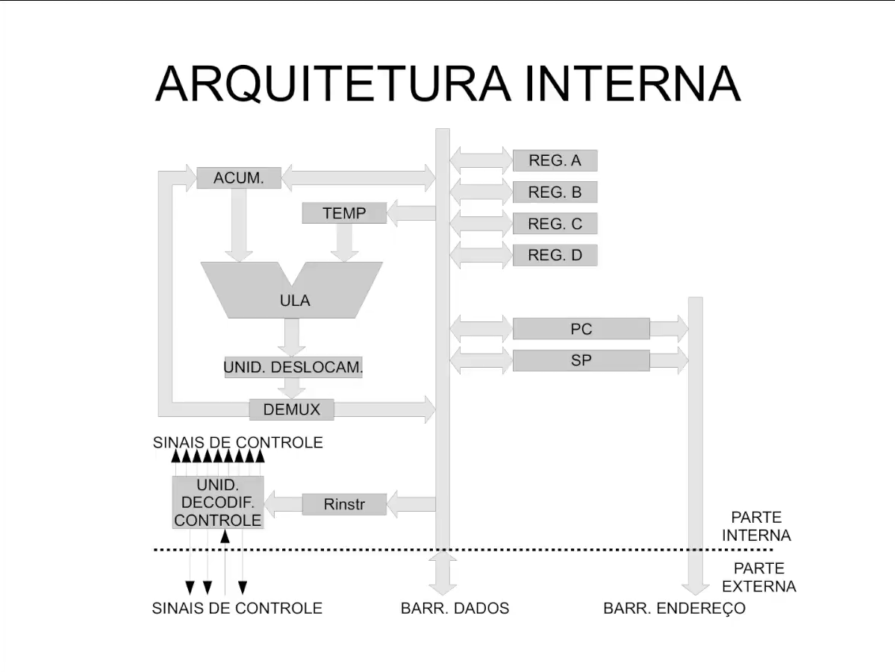

# 🖥️ Arquitetura Interna do Microprocessador  

A figura abaixo mostra os principais blocos internos de um microprocessador e como eles se comunicam para executar instruções.  
Cada parte tem sua função específica, mas todas precisam **trabalhar em conjunto** para que o processador funcione.  

# 🖥️ Arquitetura Interna do Microprocessador  

  
*Figura: Esquema simplificado da arquitetura interna de um microprocessador.*

A figura acima mostra os principais blocos internos de um microprocessador e como eles se comunicam para executar instruções.  
Cada parte tem sua função específica, mas todas precisam **trabalhar em conjunto** para que o processador funcione.  

---

## 🔹 Componentes e Funções

### 1. **Acumulador (ACUM.)**
- **O que é:** Registrador especial onde os resultados das operações são guardados.  
- **Analogia:** Uma **mesa de trabalho** onde os ingredientes (dados) ficam enquanto o cozinheiro prepara a comida.  
- **Exemplo:** Se a instrução for `5 + 3`, o acumulador guarda primeiro o `5`, depois o `3`, e finalmente o resultado `8`.

---

### 2. **Registrador Temporário (TEMP)**
- **O que é:** Um espaço extra usado durante os cálculos.  
- **Analogia:** Um **pratinho de apoio** na cozinha, onde você deixa algo separado para usar logo em seguida.  
- **Exemplo:** Para calcular `(7 + 2) – 4`, o TEMP guarda o `7 + 2 = 9` antes de subtrair o `4`.

---

### 3. **ULA (Unidade Lógica e Aritmética)**
- **O que é:** O “cérebro matemático” do processador, responsável por fazer contas e comparações.  
- **Analogia:** Um **cozinheiro** que realmente mistura os ingredientes.  
- **Exemplo:** Se a instrução é `ADD A, B`, a ULA pega os valores e devolve a soma.

---

### 4. **Unidade de Deslocamento**
- **O que é:** Faz o deslocamento de bits para a esquerda ou direita.  
- **Analogia:** Como **empurrar um prato para o lado da mesa**, reorganizando o espaço.  
- **Exemplo:** Deslocar `0101` (5) para a esquerda vira `1010` (10). É como multiplicar por 2.

---

### 5. **DEMUX (Demultiplexador)**
- **O que é:** Decide para onde a informação deve ir.  
- **Analogia:** Um **porteiro** que abre a porta certa para cada funcionário.  
- **Exemplo:** Depois de uma conta, o DEMUX decide se o resultado vai para o **acumulador** ou para a **memória**.

---

### 6. **Registradores A, B, C, D**
- **O que são:** Pequenos espaços de armazenamento rápido.  
- **Analogia:** **Gavetas de ingredientes** na cozinha.  
- **Exemplo:** Você pode deixar o número `10` no REG. A e o número `20` no REG. B, para depois usar na ULA.

---

### 7. **PC (Program Counter)**
- **O que é:** Guarda o endereço da **próxima instrução** a ser executada.  
- **Analogia:** Um **marcador de página** no livro de receitas.  
- **Exemplo:** Se a CPU acabou de rodar a linha 10 do código, o PC já aponta para a linha 11.

---

### 8. **SP (Stack Pointer)**
- **O que é:** Controla a pilha de memória (Stack).  
- **Analogia:** Uma **pilha de pratos**: sempre pega ou coloca no topo.  
- **Exemplo:** Ao chamar uma função, o SP guarda o endereço para depois retornar ao ponto correto.

---

### 9. **Unidade de Decodificação e Controle**
- **O que é:** Lê as instruções e gera sinais de controle para coordenar tudo.  
- **Analogia:** O **chefe da cozinha** que lê os pedidos e manda ordens.  
- **Exemplo:** Se a instrução for `ADD A, B`, o chefe manda:  
  - “ULA, pegue valores de A e B!”  
  - “Acumulador, guarde o resultado!”  

---

### 10. **Barramento de Dados**
- **O que é:** Caminho por onde os dados circulam.  
- **Analogia:** Um **corredor da cozinha** por onde os garçons levam ingredientes e pratos prontos.  
- **Exemplo:** Quando o resultado `8` é guardado na memória, ele viaja pelo barramento de dados.

---

### 11. **Barramento de Endereços**
- **O que é:** Caminho que indica **onde** estão os dados na memória.  
- **Analogia:** O **mapa da cozinha**, dizendo em qual prateleira buscar o ingrediente.  
- **Exemplo:** O processador pede: “vá até a gaveta 105 e traga o valor de lá”.

---

### 12. **Sinais de Controle**
- **O que são:** Regras que dizem quando ler, escrever ou parar.  
- **Analogia:** **Semáforos no corredor da cozinha**, para evitar colisões.  
- **Exemplo:** Um sinal indica “LEITURA” → pega dados da memória. Outro indica “ESCRITA” → manda dados para a memória.

---

## 🔄 Exemplo Completo de Funcionamento

Vamos simular uma instrução simples: **`C = A + B`**

1. **PC** (marcador de página) aponta para a linha da instrução `ADD A, B`.  
2. A **Unidade de Controle** lê a instrução e diz:  
   - “Busquem os valores nos registradores A e B.”  
3. Os valores são levados até a **ULA** pelo **Barramento de Dados**.  
4. A **ULA** soma os dois valores.  
5. O resultado passa pela **Unidade de Deslocamento** (caso precise ser ajustado).  
6. O **DEMUX** decide que o resultado deve ser guardado no **REG. C**.  
7. O **Acumulador** também pode armazenar o resultado temporariamente.  
8. O **PC** é atualizado para a próxima instrução.  
9. Tudo isso é coordenado pelos **Sinais de Controle**, que garantem que cada etapa ocorra no tempo certo.

---

## 🌍 Resumindo
- O microprocessador funciona como uma **cozinha organizada**, onde cada funcionário (registrador, ULA, acumulador, etc.) tem seu papel.  
- Todos dependem do **chefe (Unidade de Controle)** para saber o que fazer.  
- O **PC** garante que a receita (programa) seja seguida na ordem correta.  
- Os **barramentos** são os corredores e mapas que conectam tudo.  

👉 No fim, todos trabalham juntos para transformar **instruções escritas em linguagem de máquina** em **resultados concretos**.
