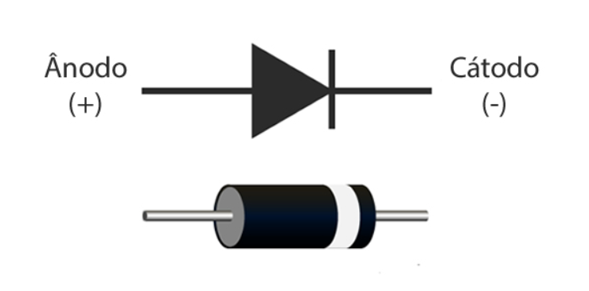

# 📘 Anotações – Diodos, LEDs e Saídas de Microcontroladores  

## 🔹 LED (Light Emitting Diode)  
- É um **diodo que emite luz**.  
- Tem **polaridade**:  
  - **Ânodo (+)** → perna maior.  
  - **Cátodo (–)** → perna menor/faixinha no encapsulamento. 
## 🔹 Símbolo e Identificação do Diodo
No símbolo esquemático:
- A seta (►) aponta do ânodo para o cátodo.  
- A barra representa o cátodo.



- **Tensão de junção (Vf):** queda fixa típica para acender:  
  - Vermelho: ~2,0 V  
  - Verde: ~2,2 V  
  - Azul/Branco: ~3,3 V  
- **Corrente típica:** 10–20 mA (usar resistor para limitar).  

**Cálculo do resistor limitador (Lei de Ohm):**  
\[
R = \frac{V_{fonte} - V_{LED}}{I_{LED}}
\]  

Exemplo: LED vermelho em 5 V, corrente 15 mA:  
\[
R = \frac{5 - 2}{0,015} \approx 200 \,\Omega \quad (\text{usar 220 Ω})
\]

- Em **paralelo**, cada LED deve ter **seu próprio resistor**.  
- Em **série**, a corrente é a mesma, mas as tensões se somam.  

---

## 🔹 Saída do microcontrolador (GPIO)  
- Cada pino de saída é formado por **transistores internos** em configuração **push-pull**:  
  - **PNP em cima** → conecta o pino ao Vcc (**fornece corrente – source**).  
  - **NPN embaixo** → conecta o pino ao GND (**drena corrente – sink**).  
- Modos:  
  - **Saída = Alto (1 lógico)** → pino ≈ Vcc, fornece corrente.  
  - **Saída = Baixo (0 lógico)** → pino ≈ 0 V, drena corrente.  
  - **Entrada (alta impedância)** → transistores desligados, pino só lê o sinal externo.  

⚠️ **Cuidado:** se configurar como saída e ligar errado (curto com Vcc ou GND), a corrente pode passar do limite → queima o transistor interno do pino.  
Por isso, **entrada é mais segura** (não fornece nem drena corrente).  

---

## 🔹 Diodo comum  
- Componente que deixa a corrente passar **apenas em um sentido**.  
- **Polarização direta (ânodo +, cátodo –):** conduz (como chave fechada).  
- **Polarização reversa (ânodo –, cátodo +):** não conduz (como chave aberta).  
- Se a tensão reversa for muito alta → rompe e **queima**.  
- Usado em sinais pequenos, proteção simples, teclados matriciais.  
- Exemplo: 1N4148.  

---

## 🔹 Diodo retificador  
- Projetado para correntes maiores (até amperes).  
- Mais lento, mas robusto.  
- Usado para **bloquear semiciclo negativo** em corrente alternada (AC) → retificação.  
- Exemplo: 1N4007 (1 A, até 1000 V).  

---

## 🔹 Diodo Zener  
- Funciona como um diodo comum em direto.  
- **Em reverso:**  
  - Bloqueia até atingir sua **tensão Zener (Vz)**.  
  - A partir disso, conduz ao contrário **sem queimar**.  
- Vantagem: pode ser usado para **regular tensão** ou **proteger entradas**.  

## 🔹 Exemplo de proteção no Arduino (5 V)

```text
Sinal ----[R]----+----> Pino Arduino
                 |
              [Zener 5,1V]
                 |
                GND
```
---
## 🔹 Palavras-chave aprendidas
- **Tensão de junção (Vf):** queda fixa no LED/diodo em condução direta.  
- **Fornecer corrente (source):** pino conecta ao Vcc.  
- **Drenar corrente (sink):** pino conecta ao GND.  
- **Polarização direta:** ânodo +, cátodo – → conduz.  
- **Polarização reversa:** ânodo –, cátodo + → não conduz (exceto no Zener acima de Vz).  
- **Alta impedância (entrada):** pino desligado internamente, só lê o que vem de fora.  

---
